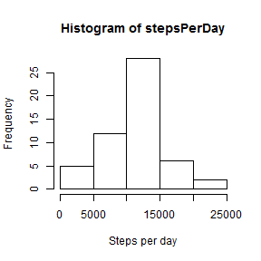
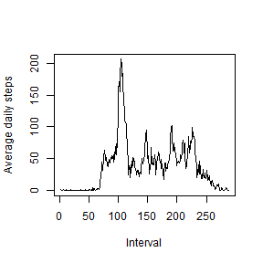
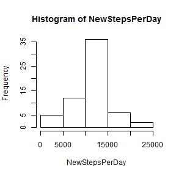
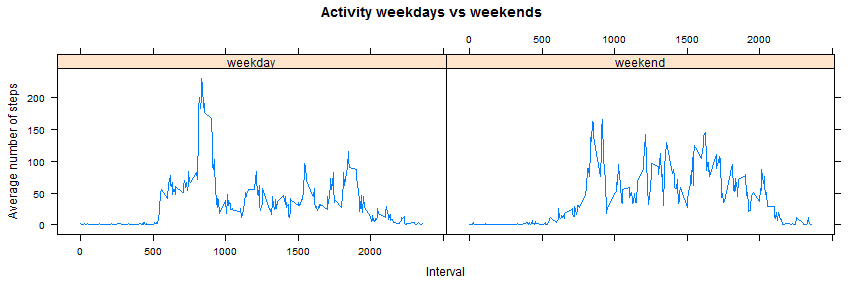

# Reproducible Research: Peer Assessment 1


## Loading and preprocessing the data
The zip data has been downloaded from [the Reproducible Research Coursera course][data]

[data]: https://d396qusza40orc.cloudfront.net/repdata%2Fdata%2Factivity.zip


```r
setwd("C:/Users/Rosa/Data Science Specialization/Reproducible research/peer_ass1/repdata_data_activity")
data <- read.csv(file = "activity.csv", colClasses = c("integer", "Date", "integer"))
attach(data)
summary(data)
```

```
##      steps            date               interval   
##  Min.   :  0.0   Min.   :2012-10-01   Min.   :   0  
##  1st Qu.:  0.0   1st Qu.:2012-10-16   1st Qu.: 589  
##  Median :  0.0   Median :2012-10-31   Median :1178  
##  Mean   : 37.4   Mean   :2012-10-31   Mean   :1178  
##  3rd Qu.: 12.0   3rd Qu.:2012-11-15   3rd Qu.:1766  
##  Max.   :806.0   Max.   :2012-11-30   Max.   :2355  
##  NA's   :2304
```


## What is mean total number of steps taken per day?
1.Histogram of total number of steps


```r
stepsPerDay <- aggregate(steps ~ date, data, sum, na.rm = TRUE)$steps
hist(stepsPerDay, xlab = "Steps per day")
```

 


2.Calculate and report the mean and median total number of steps taken per day

The Mean number of steps per day is:

```r
mean(stepsPerDay)
```

```
## [1] 10766
```


The Median number of steps per day is:

```r
median(stepsPerDay)
```

```
## [1] 10765
```


## What is the average daily activity pattern?
1.Time series plot of the 5-minute interval (x-axis) and the average number of steps taken, averaged across all days (y-axis)

```r
stepsByInterval <- aggregate(steps ~ interval, data, mean)
plot(stepsByInterval$steps, type = "l", xlab = "Interval", ylab = "Average daily steps")
```

 


2.The highest mean steps and the interval with the maximum number of steps


```r
maxInterval = which.max(stepsByInterval$steps)
maxInterval
```

```
## [1] 104
```

```r
stepsByInterval$interval[maxInterval]
```

```
## [1] 835
```

```r
stepsByInterval$steps[maxInterval]
```

```
## [1] 206.2
```


## Imputing missing values

1.Number of missing rows


```r
missingRows <- sum(is.na(steps))
missingRows
```

```
## [1] 2304
```


2.Strategy for filling in all of the missing values  
3.Create new dataset with the missing values filled in with the average number of steps from the corresponding interval. 


```r
newdata <- data

for (i in 1:length(newdata$interval)) {
    if (is.na(newdata$steps[i])) {
        newdata$steps[i] <- stepsByInterval[which(stepsByInterval$interval == 
            newdata$interval[i]), ]$steps
    } else newdata$steps[i] <- newdata$steps[i]
}
```

4.Histogram of total number of steps per day with missing data filled in


```r
NewStepsPerDay <- aggregate(steps ~ date, newdata, sum)$steps
hist(NewStepsPerDay)
```

 


New mean with missing data filled in

```r
mean(NewStepsPerDay)
```

```
## [1] 10766
```


New median with missing data filled in

```r
median(NewStepsPerDay)
```

```
## [1] 10766
```


The values are slightly higher with the data filled in.


## Are there differences in activity patterns between weekdays and weekends?
1.Create new factor with 2 levels: "weekday" and "weekend"

```r
for (i in 1:length(newdata$interval)) {
    if (weekdays(newdata$date[i]) == "Saturday" | weekdays(newdata$date[i]) == 
        "Sunday") {
        newdata$typeDay[i] <- "weekend"
    } else {
        newdata$typeDay[i] <- "weekday"
    }
}
newdata$typeDay <- factor(newdata$typeDay)
```


2.Panel plot of the 5-minute interval (x-axis) and the average number of steps taken, averaged across all weekdays or weekendays(y-axis)


```r
weekdayActivities <- aggregate(steps ~ typeDay + interval, newdata, mean)
weekendAct <- subset(weekdayActivities, typeDay == "weekend")
weekdayAct <- subset(weekdayActivities, typeDay == "weekday")
summary(weekdayAct)
```

```
##     typeDay       interval        steps       
##  weekday:288   Min.   :   0   Min.   :  0.00  
##  weekend:  0   1st Qu.: 589   1st Qu.:  2.25  
##                Median :1178   Median : 25.80  
##                Mean   :1178   Mean   : 35.61  
##                3rd Qu.:1766   3rd Qu.: 50.85  
##                Max.   :2355   Max.   :230.38
```

```r
summary(weekendAct)
```

```
##     typeDay       interval        steps       
##  weekday:  0   Min.   :   0   Min.   :  0.00  
##  weekend:288   1st Qu.: 589   1st Qu.:  1.24  
##                Median :1178   Median : 32.34  
##                Mean   :1178   Mean   : 42.37  
##                3rd Qu.:1766   3rd Qu.: 74.65  
##                Max.   :2355   Max.   :166.64
```

```r

library(lattice)
xyplot(steps ~ interval | typeDay, data = weekdayActivities, type = "l", xlab = "Interval", 
    ylab = "Average number of steps", main = "Activity weekdays vs weekends")
```

 


The subject weekend activity mean is 42.366 higher than the mean in weekday that is 35.611. So the subject seems to walk more on the weekend. However the maximun value of steps is in weekday 230.378. 

